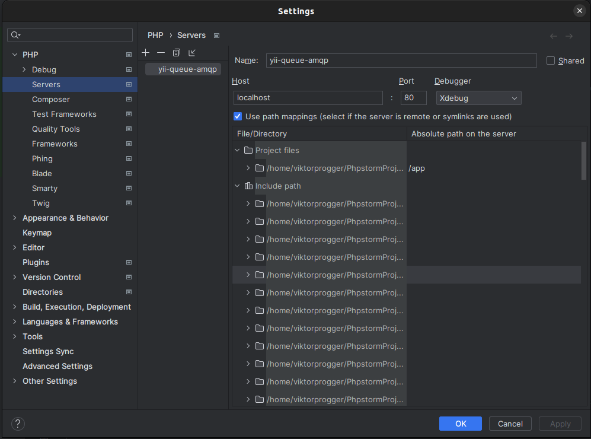

<p align="center">
    <a href="https://github.com/yiisoft" target="_blank">
        
    </a>
    <h1 align="center">Yii Queue AMQP Adapter</h1>
    <br>
</p>

AMQP adapter based on [php-amqplib](https://github.com/php-amqplib/php-amqplib) package for [Yii Queue](https://github.com/yiisoft/yii-queue).

[](https://packagist.org/packages/yiisoft/yii-queue-amqp)
[](https://packagist.org/packages/yiisoft/yii-queue-amqp)
[](https://github.com/yiisoft/yii-queue-amqp/actions?query=workflow%3Abuild)
[](https://scrutinizer-ci.com/g/yiisoft/yii-queue-amqp/?branch=master)
[](https://scrutinizer-ci.com/g/yiisoft/yii-queue-amqp/?branch=master)
[](https://github.com/yiisoft/yii-queue-amqp/actions?query=workflow%3A%22static+analysis%22)
[](https://dashboard.stryker-mutator.io/reports/github.com/yiisoft/yii-queue-amqp/master)
[](https://shepherd.dev/github/yiisoft/yii-queue-amqp)

## Installation

The preferred way to install this extension is through [composer](http://getcomposer.org/download/).

Either run

```shell
composer require yiisoft/yii-queue-amqp
```

or add

```
"yiisoft/yii-queue-amqp": "dev-master"
```

to the `require` section of your `composer.json` file.

## Extra

### Docker

_Don't forget you have to have the latest version of `docker` installed and running on your computer in order to use it._

#### Developer environment
This project has ready to use docker environment inside the `tests` directory.  
It uses `docker-compose.yml` by default, which is meant to work fine inside CI steps.

To comfortably use docker environment to run tests on your own machine you should extend the default
`docker-compose.yml` with the additional config file `docker-compose.development.yml`. The simplest way is
to copy `.env.example` file with name `.env`. It has essential environment variables to use both these `yml` configurations.
Review these variables and change if needed.

Then you can use docker compose as always. To execute unit tests, run the command
`docker compose run --rm php82 vendor/bin/phpunit` inside the `tests` folder.
You can also choose the needed version of php instead of 8.2.

#### xDebug and PhpStorm
For xDebug to work properly with PhpStorm, you have to additionally configure your PhpStorm.
Open Settings and add a new Server in the PHP settings block:
- Set server name to `yii-queue-amqp`.
- Enable path mappings.
- Set your project root equal to the path `/app` on the server.

These settings are properly set on the screenshot below:


#### Unit testing

The package is tested with [PHPUnit](https://phpunit.de/). To run tests:

```php
cd tests && docker compose build && docker compose run --rm php82 vendor/bin/phpunit
```

You can use any of the supported PHP versions with service names `php80`, `php81` and `php82`.  
To debug code with xDebug and to use volumes inside the built containers, you can use
`test/docker-compose.development.yml`. To do so you should either run
`docker compose -f docker-compose.yml -f docker-compose.development.yml run --rm php<version> vendor/bin/phpunit`
or copy [tests/.env.example](tests/.env.example) into `tests/.env` and run tests as usual.


Also, if you are using Docker, then you have access to a set of prepared commands in the Makefile

#### Static analysis

```bash
# {{ v }} = 80, 81, 82
make static-analyze v=80
```

#### Unit tests

```bash
# {{ v }} = 80, 81, 82
make test v=80
```

#### Mutation tests

```bash
# {{ v }} = 80, 81, 82
make mutation-test v=80
```

#### Code coverage

```bash
# {{ v }} = 80, 81, 82
make coverage v=80
```

### Static analysis

The code is statically analyzed with [Psalm](https://psalm.dev). To run static analysis:

```php
./vendor/bin/psalm
```

### Support the project

[](https://opencollective.com/yiisoft)

### Follow updates

[](https://www.yiiframework.com/)
[](https://twitter.com/yiiframework)
[](https://t.me/yii3en)
[](https://www.facebook.com/groups/yiitalk)
[](https://yiiframework.com/go/slack)

## License

The Yii Queue AMQP Adapter is free software. It is released under the terms of the BSD License.
Please see [`LICENSE`](./LICENSE.md) for more information.

Maintained by [Yii Software](https://www.yiiframework.com/).
