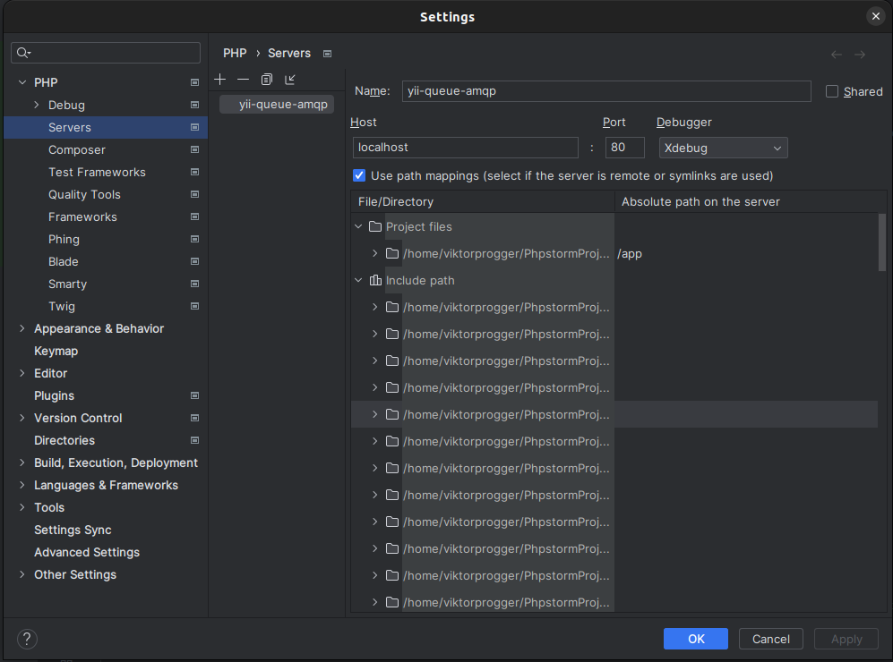

# Internals

## Docker

_Don't forget you have to have the latest version of `docker` installed and running on your computer in order to use it._

### Developer environment

This project has ready to use docker environment inside the `tests` directory.  
It uses `docker-compose.yml` by default, which is meant to work fine inside CI steps.

To comfortably use docker environment to run tests on your own machine you should extend the default
`docker-compose.yml` with the additional config file `docker-compose.development.yml`. The simplest way is
to copy `.env.example` file with name `.env`. It has essential environment variables to use both these `yml` configurations.
Review these variables and change if needed.

Then you can use docker compose as always. To execute unit tests, run the command
`docker compose run --rm php82 vendor/bin/phpunit` inside the `tests` folder.
You can also choose the needed version of php instead of 8.2.

### xDebug and PhpStorm

For xDebug to work properly with PhpStorm, you have to additionally configure your PhpStorm.
Open Settings and add a new Server in the PHP settings block:
- Set server name to `yii-queue-amqp`.
- Enable path mappings.
- Set your project root equal to the path `/app` on the server.

These settings are properly set on the screenshot below:


### Unit testing

The package is tested with [PHPUnit](https://phpunit.de/). To run tests:

```php
cd tests && docker compose build && docker compose run --rm php82 vendor/bin/phpunit
```

You can use any of the supported PHP versions with service names `php80`, `php81` and `php82`.  
To debug code with xDebug and to use volumes inside the built containers, you can use
`test/docker-compose.development.yml`. To do so you should either run
`docker compose -f docker-compose.yml -f docker-compose.development.yml run --rm php<version> vendor/bin/phpunit`
or copy [tests/.env.example](../../tests/.env.example) into `tests/.env` and run tests as usual.

Also, if you are using Docker, then you have access to a set of prepared commands in the Makefile

### Static analysis

The code is statically analyzed with [Psalm](https://psalm.dev). To run static analysis:

```bash
# {{ v }} = 81, 82, 83
make static-analyze v=81
```

### Unit tests

```bash
# {{ v }} = 81, 82, 83
make test v=81
```

### Mutation tests

```bash
# {{ v }} = 81, 82, 83
make mutation-test v=83
```

### Code coverage

```bash
# {{ v }} = 81, 82, 83
make coverage v=81
```
